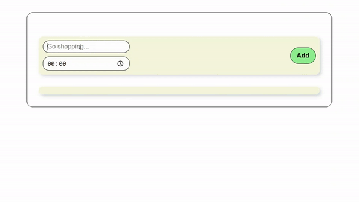
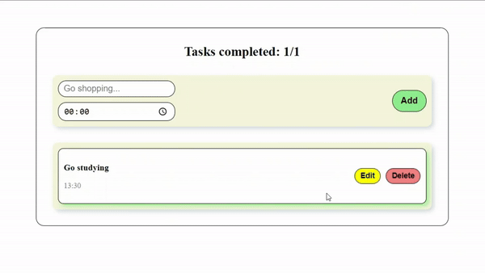
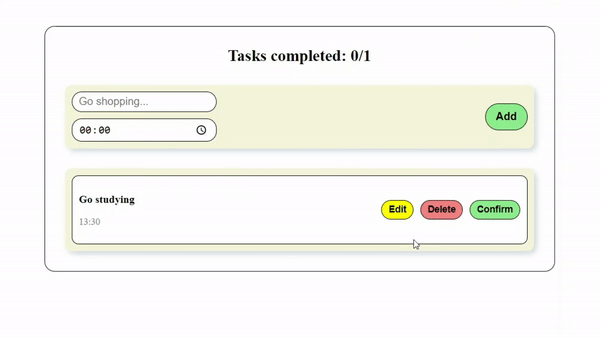
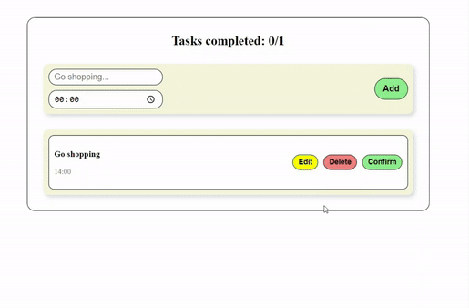

**BRIEF DESCRIPTION**

This React app, called Todo List, is a simple tool for managing your tasks. You can add, edit, delete, and mark tasks as completed

**FEATURES**

- **Dynamic Task Management:** Users can dynamically add new tasks with descriptions and designated times, providing clarity and order to their to-do list

- **Real-time Updates:** The application allows users to edit task details and times, ensuring that plans can be adjusted on the fly without hassle

- **Progress Tracking:** With the ability to mark tasks as completed, users gain a visual representation of their progress, encouraging productivity

- **Local Storage:** This project leverages the Web Storage API to store tasks persistently in the browser's local storage, allowing data to remain intact across browser sessions

- **Interactive UI:** A custom modal component enhances interactivity, offering an intuitive interface for editing tasks

- **Modal component:** Demonstrates the use of modals in React for editing content, emphasizing the application's dynamic interaction capabilities.

**TECHNOLOGIES**

React: The entire application is built using React, showcasing functional components, hooks (such as useState and useEffect), and event handling

**LOCAL STORAGE**

Using the Web Storage API in this project, we make sure that tasks are saved permanently across different sessions of the browser. When it starts, it gets and parses the tasks from the local storage and sets them as the initial state:

```
const [data, setData] = useState(localStorage.getItem("data") ? JSON.parse(localStorage.getItem("data")) : []);
```

Any time a task is modified, it triggers an update to the data. The useEffect hook catches these changes and updates local storage with the latest data:

```
useEffect(() => {
    localStorage.setItem("data", JSON.stringify(data));
  }, [data]);
```
This functionality ensures tasks are automatically saved and remain accessible, enhancing user experience through seamless data persistence
___
**ADDING NEW TASKS**

1. The **handleAdd** function adds tasks to your to-do list, but only if you give it some details. If you leave the description field empty, it will complain, **"Text required!!"**
2. If you pass the check and add some text, **handleAdd** will create a new new spot on your list with all the task info: a unique IDso it knows what task it is, what you wrote down, when it needs to be done, and marks it as not done yet
3. After adding your task, handleAdd cleans up by clearing out the text and time you typed. This makes sure every task has the info it needs and keeps your input fields clean  after adding a new task

```
function handleAdd() {
    if (text != "") {
      setData((prev) => [
        ...prev,
        { id: Date.now(), text, time, completed: false },
      ]);
      setText("");
      setTime("00:00");
    } else {
      alert("Text required!");
    }
  }
```
When you click the **Add** button, **onClick** calls the **handleAdd** function to run

```
<button onClick={handleAdd} className="todo-btn"> Add </button>
```



___
**REMOVING TASKS**

1. The **handleDelete** function is designed to remove tasks from your to-do list. Before deleting a task, the app asks (prompts) the user if they're sure they want to delete it _"Are you sure you want to delete this task?"_ This step makes sure that tasks don't get deleted by mistake
2. After getting a positive response, the function removes the task with the __specified ID__ from the current list. This is done by removing all tasks that __don't match the specified task ID__, so it effectively removes the target task from the list
3. This operation gives you a new list that doesn't __include the deleted task__, but it keeps everything else the same as the original list. Only unnecessary tasks will be deleted if the user explicitly requests it

```
function handleDelete(id) {
if (window.confirm("Are you sure you want to delete?")) {
    setData((prev) =>
      prev.filter((item) => {
      return item.id != id;
      })
    );
  }
}
```
We pass props in the parameters of the **TodoItem** component

```
<TodoItem
  item={item}
  key={item.id}
  handleDelete={handleDelete}
/>
```

The **onClick** in the **button** tells the app to run handleDelete with the task's id when the button is clicked. The arrow function **() => handleDelete(item.id)** makes sure the function runs with the correct parameters when you click the "Delete" button. This makes the app easier to use

```
 <button onClick={() => handleDelete(item.id)}
className="todo-btn btn-delete"> Delete </button>
```


___

**COMPLETING TASKS**

The **handleComplete** function updates the status of a todo item to **completed**. It takes an **ID** as its **parameter**, then goes through the list of current tasks **(prev)** one by one. For each item, if its **ID** matches the provided id, the item's **completed** status is set to **true**. This marks the item as completed without changing  the rest of the items.

```
function handleComplete(id) {
    setData((prev) =>
      prev.map((item) => {
        if (item.id == id) {
          item.completed = true;
        }
        return item;
      })
  );
}
```

We pass props in the parameters of the **TodoItem** component

```
<TodoItem
  item={item}
  key={item.id}
  handleComplete={handleComplete}
/>
```

1. This condition renders a **Confirm** button for todo items that are not yet completed **(!item.completed)**
2. When you click the button, it calls the **handleComplete** function with the **ID** of the specific task. That changes the **completed** status of the task to **true**
3. The use of conditional rendering **({!item.completed && (...)})** makes sure that the **Confirm** button only shows up for items that haven't been completed, giving users a clear way to mark tasks as done.

```
{!item.completed && (
    <button onClick={() => handleComplete(item.id)} className="todo-btn btn-confirm"> Confirm </button>
 )}
```


___

**SAVING AND EDITING**

Using the State hook, we create a variable called **open** that determines whether the modal should be visible or not

```
const [open, setOpen] = useState(false);
```
The **handleSave** function updates an existing task's details, like its description and  time. It loops through the tasks array and finds the one by its **ID**, then applies the changes. After that, it closes a modal by calling the **handleClose** function

```
function handleSave(text, time, id) {
  setData((prev) =>
    prev.map((item) => {
      if (item.id == id) {
        item.text = text;
        item.time = time;
      }
      return item;
    })
  );
  handleClose();
}
```
The app renders the component conditionally based on the **open** state variable. When **open** is true, the Modal component gets rendered. 

```
{open && (
  <Modal handleClose={handleClose} item={open} handleSave={handleSave} />
)}
```




